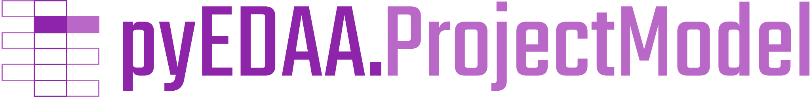
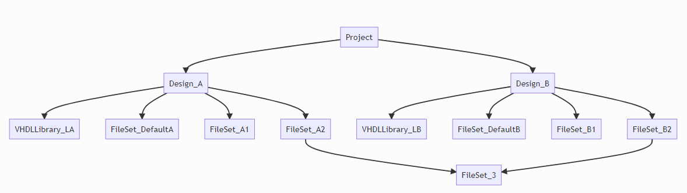

<p align="center">
  <a title="edaa-org.github.io/pySVModel" href="https://edaa-org.github.io/pyEDAA.ProjectModel"></a>
</p>

[](https://github.com/edaa-org/pyEDAA.ProjectModel)
[](LICENSE.md)
[](https://github.com/edaa-org/pyEDAA.ProjectModel/tags)
[](https://github.com/edaa-org/pyEDAA.ProjectModel/releases/latest)
[](https://github.com/edaa-org/pyEDAA.ProjectModel/releases)  
[](https://github.com/edaa-org/pyEDAA.ProjectModel/actions?query=workflow%3A%22Unit%20Testing,%20Coverage%20Collection,%20Package,%20Release,%20Documentation%20and%20Publish%22)
[](https://www.codacy.com/manual/edaa-org/pyEDAA.ProjectModel)
[](https://www.codacy.com/manual/edaa-org/pyEDAA.ProjectModel)
[](https://codecov.io/gh/edaa-org/pyEDAA.ProjectModel)
[](https://libraries.io/github/edaa-org/pyEDAA.ProjectModel/sourcerank)  
[](https://pypi.org/project/pyEDAA.ProjectModel/)


[](https://libraries.io/github/edaa-org/pyEDAA.ProjectModel)  
[](LICENSE.md)
[](https://edaa-org.github.io/pyEDAA.ProjectModel/)

<!--
[](https://github.com/edaa-org/pyEDAA.ProjectModel/network/dependents)
[](https://requires.io/github/edaa-org/pyEDAA.ProjectModel/requirements/?branch=main)
-->

# Main Goals

This package provides a unified abstract project model for HDL designs and EDA tools.
Third-party frameworks can derive own classes and implement additional logic to create
a concrete project model for their tools.

Frameworks consuming this model can build higher level features and services on top of
such a model, while supporting multiple input sources.

## Data Model

1. The toplevel element is a `Project`, which contains one or multiple designs.
2. A `Design` is a variant of a project and contains filesets.
3. A `FileSet` contains files or further sub-filesets.
4. A `File` represents a single file. E.g. source files, configuration files, constraint files.
5. A `VHDLLibrary` represents a group of `VHDLSourceFile`s being compiled into the same VHDL library.



## Features

* Construct a project model:  
  * top-down (project &rarr; design &rarr; fileset &rarr; file) or
  * bottom-up (file &rarr; fileset &rarr; design &rarr; project) or
  * parsing a project file.
* Designs, filesets and files can use absolute or relative paths.
  * `ResolvedPath` returns the resolved absolute path to an object.
* Projects, designs, filesets and files can be validated (e.g. if the path exists).
* Projects, designs, filesets and files can have user-defined attributes.
  * User-defined attributes are resolved bottom-up.


## Project File Readers

### OSVVM `*.pro` File Reader

ProjectModel can read `*.pro` files and extract source files. Included `*.pro` files
are represented as sub-filesets.

### Xilinx Vivado `*.xpr` Reader

ProjectModel can read `*.xpr` files and extract source, constraint and simulation
files while preserving the fileset structure.

## Use Cases
* Reading OSVVM's `*.pro` files.
* Reading Xilinx Vivado's `*.xpr` files.


## Examples

```python
from pathlib import Path
from pyEDAA.ProjectModel import Project, Design, FileSet, VHDLSourceFile

print(f"Current working directory: {Path.cwd()}")
projectDirectory = Path.cwd() / "../project"
print(f"Project directory: {projectDirectory!s} - {projectDirectory.exists()}")

project = Project("myProject", rootDirectory=projectDirectory)
designA = Design("designA", project=project, directory=Path("designA"))
designAFileset = FileSet("srcA", design=designA)
for vhdlFilePath in designAFileset.ResolvedPath.glob("*.vhdl"):
	designAFileset.AddFile(VHDLSourceFile(vhdlFilePath))

libFileset = FileSet("lib", Path("../lib"), design=designA)
for vhdlFilePath in libFileset.ResolvedPath.glob("*.vhdl"):
	libFileset.AddFile(VHDLSourceFile(vhdlFilePath))

print(f"All VHDL files in {designA.Name}:")
for file in designA.Files(fileType=VHDLSourceFile):
	print(f"  {file.Path}")
```


# References

- [Paebbels/pyIPCMI: pyIPCMI/Base/Project.py](https://github.com/Paebbels/pyIPCMI/blob/master/pyIPCMI/Base/Project.py)
- [VUnit/vunit: vunit/project.py](https://github.com/VUnit/vunit/blob/master/vunit/project.py)
- [PyFPGA/pyfpga: fpga/project.py](https://github.com/PyFPGA/pyfpga/blob/main/fpga/project.py)
- [olofk/fusesoc: fusesoc/capi2/core.py](https://github.com/olofk/fusesoc/blob/master/fusesoc/capi2/core.py)
- [XedaHQ/xeda: xeda/flows/flow.py](https://github.com/XedaHQ/xeda/blob/master/xeda/flows/flow.py)
- [tsfpga/tsfpga: tsfpga/build_project_list.py](https://gitlab.com/tsfpga/tsfpga/-/blob/master/tsfpga/build_project_list.py)
- [hdl-make: hdlmake/](https://ohwr.org/project/hdl-make/tree/master/hdlmake)
- [OSVVM/OSVVM-Scripts: OsvvmProjectScripts.tcl](https://github.com/OSVVM/OSVVM-Scripts/blob/master/OsvvmProjectScripts.tcl)


## Contributors
* [Patrick Lehmann](https://github.com/Paebbels) (Maintainer)
* [Unai Martinez-Corral](https://github.com/umarcor)
* [Stefan Unrein](https://github.com/stefanunrein)
* [and more...](https://github.com/edaa-org/pyEDAA.ProjectModel/graphs/contributors)


## License

This Python package (source code) licensed under [Apache License 2.0](LICENSE.md).  
The accompanying documentation is licensed under [Creative Commons - Attribution 4.0 (CC-BY 4.0)](doc/Doc-License.rst).

-------------------------
SPDX-License-Identifier: Apache-2.0
